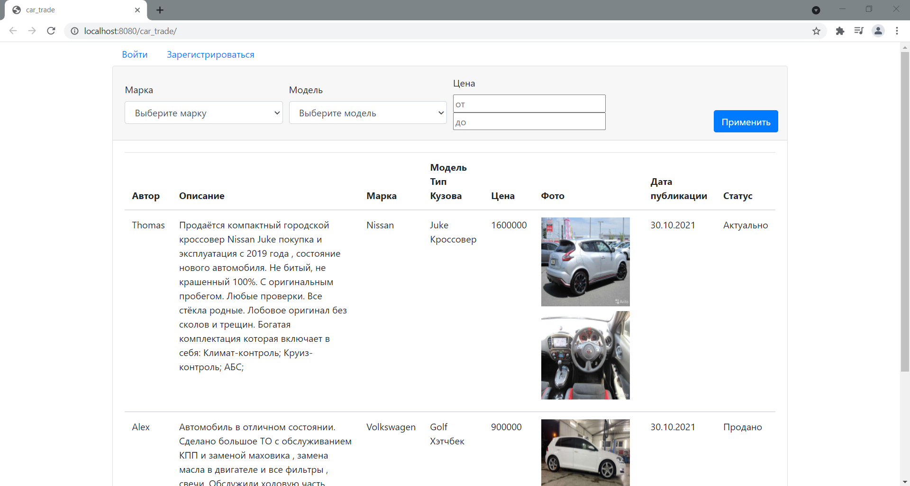
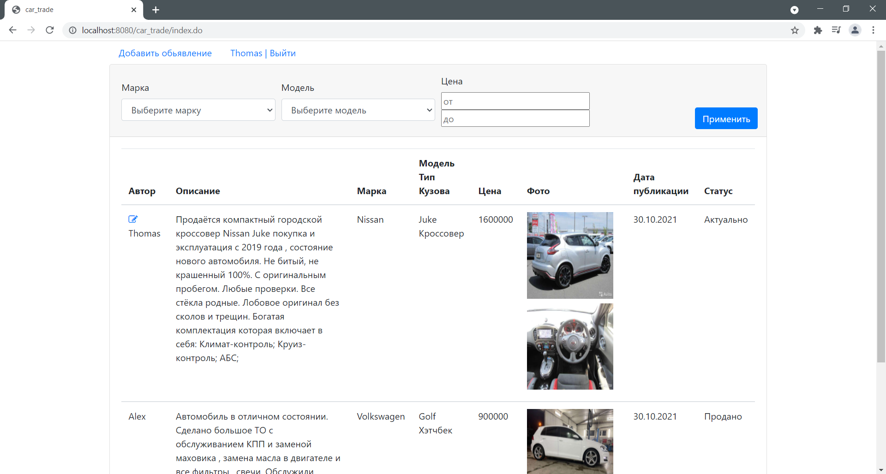
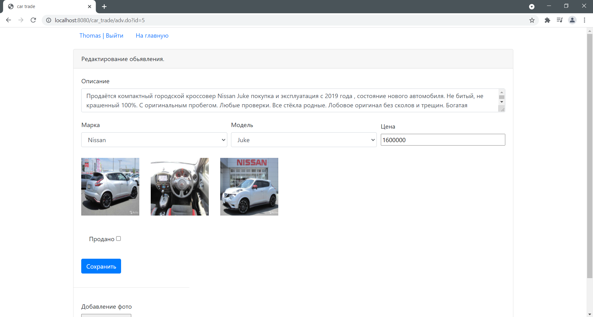
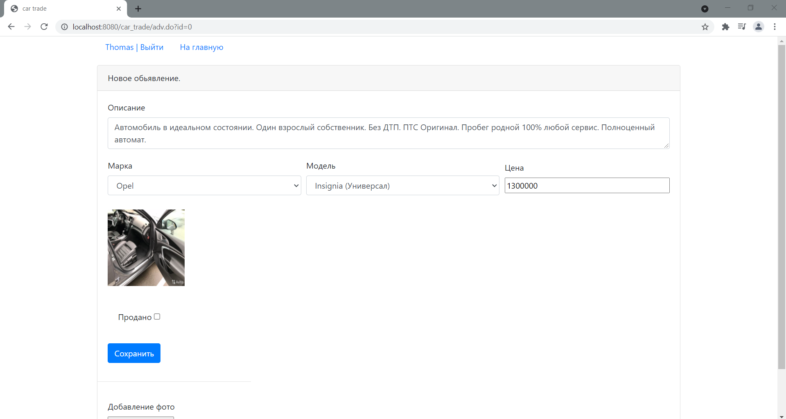

CarTrade
=============

This project is platform for buying and selling cars. Allows you to place 
advertisements for the sale of a car, change the status of an advertisement, 
view advertisements of other users.

#### Dependencies

* Java 14
* Servlets
* JSP(JSTL), JavaScript(JQuery, Ajax), Bootstrap
* Hibernate + PostgreSQL
* Junit, Hamcrest
* Maven
* Tomcat
* Log4j, Slf4j
* Travis CI
* Checkstyle

#### Demo
       

              